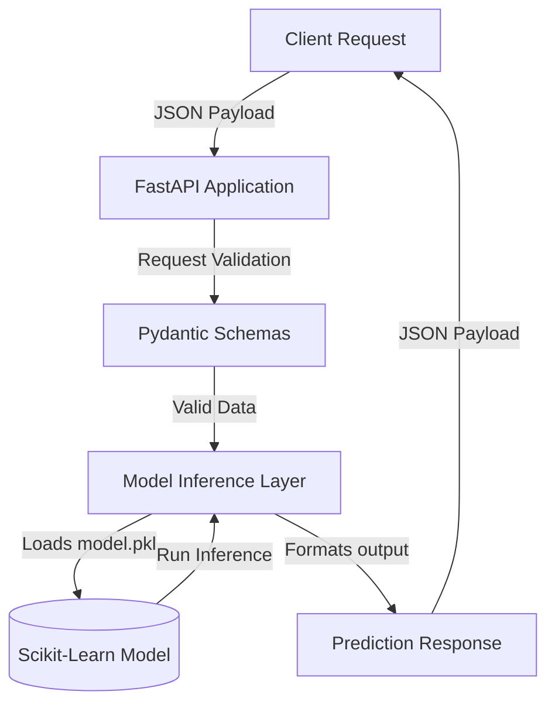

# 📖 API & Model Deployment Documentation

This document provides a comprehensive technical overview of the Iris Classifier ML Inference API, including architecture design, data schemas, model details, containerization strategy, and production deployment recommendations.

---

## 🛠️ System Architecture

The project is structured as a modular microservice. The diagram below illustrates the application flow from the client request to the model inference and back.



---

## 📁 Repository Layout

```
ml_api/
├── app/
│   ├── __init__.py      # Package initialization
│   ├── main.py          # FastAPI app instance and routing
│   ├── model.py         # Model loading and inference wrappers
│   └── schemas.py       # Pydantic validation schemas
├── model/
│   └── model.pkl        # Serialized Random Forest classifier
├── .dockerignore        # Docker build context exclusions
├── Dockerfile           # Multi-stage containerization build file
├── documentation.md     # System architecture and API documentation
├── README.md            # Quick-start guide and curl examples
├── requirements.txt     # Pinned Python package dependencies
└── train_model.py       # One-shot training and evaluation script
```

---

## 🤖 Model Details

- **Dataset**: Classic Fisher's Iris Dataset (150 samples, 4 numerical features, 3 target classes).
- **Target Classes**:
  - `0`: Setosa
  - `1`: Versicolor
  - `2`: Virginica
- **Algorithm**: Random Forest Classifier (`n_estimators=100`, `random_state=42`).
- **Input Features**:
  1. Sepal Length (cm)
  2. Sepal Width (cm)
  3. Petal Length (cm)
  4. Petal Width (cm)
- **Evaluation Metric**: Achieved 100% classification accuracy on the 20% validation split.

---

## 📡 Endpoint Specifications

### 1. Root Redirect

- **Path**: `GET /`
- **Description**: Redirects incoming requests automatically to the interactive Swagger UI `/docs`.

---

### 2. Service Health Status

- **Path**: `GET /health`
- **Response Schema (`HealthResponse`)**:
  ```json
  {
    "status": "healthy",
    "model_loaded": true,
    "model_type": "RandomForestClassifier"
  }
  ```

---

### 3. Single Prediction

- **Path**: `POST /predict`
- **Request Schema (`PredictionRequest`)**:
  ```json
  {
    "sepal_length": 5.1,
    "sepal_width": 3.5,
    "petal_length": 1.4,
    "petal_width": 0.2
  }
  ```
- **Response Schema (`PredictionResponse`)**:
  ```json
  {
    "prediction": 0,
    "predicted_class": "setosa",
    "probabilities": {
      "setosa": 1.0,
      "versicolor": 0.0,
      "virginica": 0.0
    }
  }
  ```

---

### 4. Batch Prediction

- **Path**: `POST /predict/batch`
- **Request Schema (`BatchPredictionRequest`)**:
  ```json
  {
    "instances": [
      {
        "sepal_length": 5.1,
        "sepal_width": 3.5,
        "petal_length": 1.4,
        "petal_width": 0.2
      },
      {
        "sepal_length": 6.7,
        "sepal_width": 3.0,
        "petal_length": 5.2,
        "petal_width": 2.3
      }
    ]
  }
  ```
- **Response Schema (`BatchPredictionResponse`)**:
  ```json
  {
    "predictions": [
      {
        "prediction": 0,
        "predicted_class": "setosa",
        "probabilities": {
          "setosa": 1.0,
          "versicolor": 0.0,
          "virginica": 0.0
        }
      },
      {
        "prediction": 2,
        "predicted_class": "virginica",
        "probabilities": {
          "setosa": 0.0,
          "versicolor": 0.04,
          "virginica": 0.96
        }
      }
    ]
  }
  ```

---

## 🐳 Containerization Design

The service is packaged using a **multi-stage Docker build** outlined in the `Dockerfile`.

### Build Stage (`builder`)

- Pulls `python:3.11-slim`.
- Installs all dependencies (including training-related frameworks).
- Copies files, executes `train_model.py` to create `model/model.pkl`.

### Production Stage (Final Image)

- Pulls a clean `python:3.11-slim` image.
- Installs runtime dependencies.
- Copies only `app/` and the output `/app/model/model.pkl` from the builder stage.
- **Benefit**: Ensures the deployment image size is minimized and keeps the raw training source data outside the production container.

---

## 📈 Production Best Practices

To scale this service in a production environment, consider the following recommendations:

### 1. Process Management & Concurrency

By default, Uvicorn runs a single worker. For production, run behind a process manager or run multiple workers to leverage multi-core CPU architectures:

```bash
python -m uvicorn app.main:app --host 0.0.0.0 --port 8000 --workers 4
```

### 2. Reverse Proxy

Place the service behind a reverse proxy like **Nginx** or an API Gateway (e.g., Kong, AWS API Gateway) to handle SSL termination, rate limiting, and request buffering.

### 3. Monitoring & Observability

- **Structured Logging**: Replace standard prints with structured logging (e.g., `structlog` or standard Python `logging` module configured for JSON output) to aggregate logs to Elasticsearch, Datadog, or Grafana Loki.
- **Metrics**: Export endpoints statistics (requests/second, latency, error rates, system memory/CPU) to **Prometheus** using middleware like `prometheus-fastapi-instrumentator`.

### 4. Continuous Integration & Deployment (CI/CD)

- Automate linting (`flake8` or `black`), static type analysis (`mypy`), and testing (`pytest`) on every commit.
- Automate building the Docker image and pushing it to a container registry (e.g., Docker Hub, AWS ECR, GCP GCR).
